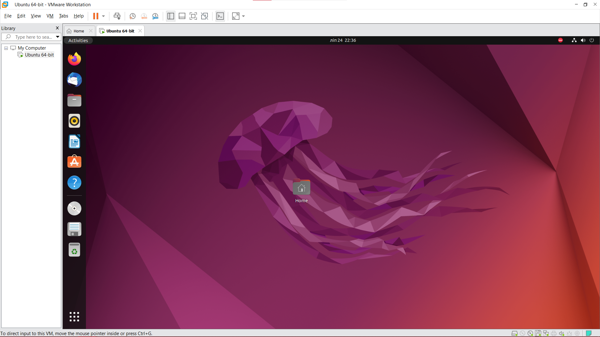

## Version of VM application

_VMware Workstation 16 Pro 16.2.3 Build 19376536_

## Steps and configurations

1. Clicked "Create a New Virtual Machine" button
2. Chose "Typical" type of configuration in New Virtual Machine Wizard
3. Chose the disk image of installed iso Ubuntu 64-bit 22.04.2
4. Personalized the Linux with data such as full name, username, etc.
5. Specified configuration as recommended on official page of Ubuntu.
    * Config is following:
      * 25 GB of disk space
      * 4 GB of system memory
      * 1 processor with 2 cores
      * NAT network configuration to share host's IP address
      * USB 2.0 compatibility with bluetooth and showing all the USB devices
      * Using default host sound card
      * Maximum amount of graphical memory is 8 GB
6. Clicked finish with "Start after creation" toggled on. 
7. Chose English language.
8. Chose minimal installation without auto-updates
9. Chose "Erase disk and Install Ubuntu"

## Screenshot

